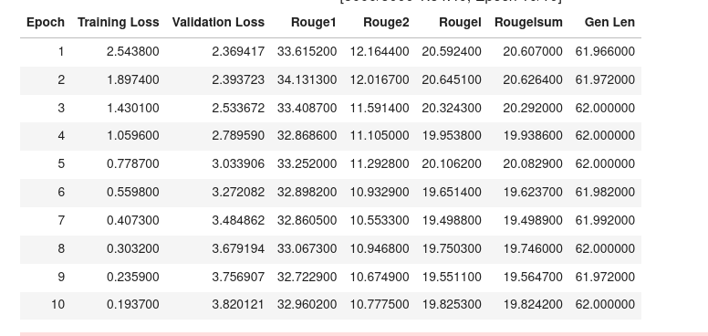
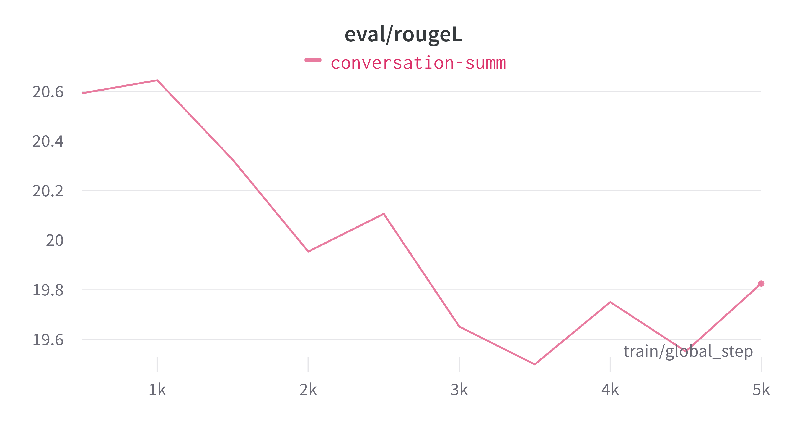

# Text-Summarization-Multi-News

Multi-News, consists of news articles and human-written summaries of these articles from the site newser.com. Each summary is professionally written by editors and includes links to the original articles cited.

There are two features:

    document: text of news articles seperated by special token "|||||".
    summary: news summary.

The BART model for text summarization was fit and trained for 10 epochs.
The model predicts a new summary given an article.
The Rouge metric was used for evaluation:

ROUGE-N measures the number of matching ‘n-grams’ between our model-generated text and a ‘reference’.  

An n-gram is simply a grouping of tokens/words. A unigram (1-gram) would consist of a single word. A bigram (2-gram) consists of two consecutive words: 

For ROUGE-1 we would be measuring the match-rate of unigrams between our model output and reference.  
ROUGE-2 and ROUGE-3 would use bigrams and trigrams respectively.  
ROUGE-L measures the longest common subsequence (LCS) between our model output and reference.  

RougeLsum :Newlines in the text are interpreted as sentence boundaries, and the LCS is computed between each pair of reference and candidate sentences, This is called rougeLsum.  

Optimizer | Learning Rate $\gamma$ | | Momentum $\eta$ | Alpha $\alpha$ | Beta1 $\beta_1$ | Beta2 $\beta_2$
| --- | --- | --- | --- | --- | --- | --- |
AdamW | 5e-5 |    |     |     | 10e-3 |10e-4|
RMSprop | 0.01 | 0.01 | 0.99|     | 10e-3  | 10e-5|
NAG | 5e-5 |
SGD(Momentum)| 5e-5 | 0.001|
SGD   | 0.01 | 

    
**Comparing the Training loss of all optimizers**
 

**Comparing the Validation loss of all optimizers**
 

The rate of convergence of the Adam optimizer is the fastest.

We can conclude the order of convergence of the optimizers:
AdamW > RMSprop > NAG > SGD (Momentum) > SGD

<img src = "plots/6.bart_gen_len.png"

